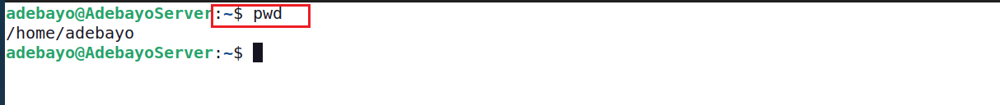

# Linux Practice Project
 ## Linux Commands
 A Linux command is a program or utility that runs on the CLI - a consol tha interacts with the system via text and processes.
 I executed the following linux commands on the Ubuntu terminal by pressing enter at the end of the command line.
 I executed the following commands:
 ### 1. Sudo Command:
 Short for superuser do. I use this command to perform tasks that require administrative or root permissions 
 example `sudo apt upgrade` see below .png>)
 ### 2.  pwd command
 I use the pwd command to find the path of my current/present working directory. I use the following syntax `pwd [option]` see below 

 ### 3. cd command
 I use the cd command to navigate the Linux files and directories. running the command without an option takes me to the home folder. I use the following syntax `cd [location]` see below 

### 4.  ls command
I use the ls command to get the files and directories list in the system or directory. the following syntax is applicable `ls [location]` `ls -r {lists files in the sub directories}` `ls -a {show hidden files}` `ls -lh {show file sizes}` see below 

### 5. cat command
I use the cat command (Concatenate) to list, combine and write file content out syntax is `cat [filename]` see below 

### 6. cp command
I use the cp command to copy files or directories and their content. syntax `cp [filename]` see below  

### 7. mv command
I use the mv command to move and rename files and directories. See below 

### 8. mkdir command
I use the mkdir command to create directories. syntax `mkdir [directoryname]`. see below 

### 9. rmdir command
i use the rmdir comand to permanently delete an empty directory. syntax `rmdir [directoryname]`. see below 

### 10. rm command
I use the rm command to delete files within a directory. syntax `rm [filename]`. see below 

### 11. touch command
I use the touch command to create an empty file or generate and modify a timestamp. syntax `touch [filename]` see below 

### 12. locate command
I use the locate command to find a file in the database system. see below 

### 13. find command
I use the find command to search for files within a specific directory. syntax `find [option] [path] [expression]` see below 

### 14. grep command
I use the grep command to find a word by searching through all the text in a specific file. see below 

### 15. df command
I use the df command to get the system's disk space usage. syntax `df [option] [file]` see below 

### 16. du command
I use the du command to check how much space a file or a directory takes up. see below 

### 17. head command
I use the head command to view the first ten lines of a text or file. syntax `head [option] [file]` see below 

###18. tail command
I use the tail command to display the last ten lines of a file or text. syntax `tail [option] [file]` see below 

### 19. diff command
I use the diff command to compare contents of two files line by line. Syntax `diff [option] [file1 file2]` see below 

### 20. tar command
I use the tar command to archive files into a TAR file. syntax `tar [option][archive_file][file or directory to be archived]` see below 

### 21. chmod command
I use the chmod command to modify a file or directory's read, write and execute permissions. syntax `chmod [option][permission] [file_name]` see below

### 22. chown command
I use the chow command to change the ownership of a file, directory or symbolic link to a specified username. syntax `chown [option] owner[:group] files`

### 23. jobs command
I use the jobs command to display all the running processes along with their statuses. syntax `jobs [option] jobID`

### 24. kill command
I use the kill command to terminante an unresponsive program manually. syntax `kill [signal_option] pid`

### 25. ping command 
I use the ping command to check whether a network or server is reachable. syntax `ping [option] [hostname_or_IP_address]` see below 

### 26. wget command
I use the wget command to download files from the internet. syntax `wget [option] [url]` see below

### 27. uname command
I use the uname command to get detailed information about my Linux system and hardware. this includes the machine name, operating system and kernel. syntax `uname [option]` see below

### 28. top command
I use the top command to get a view of all the running processess and a dynamic real-time view of the current system. syntax `top` see below

### 29. history command
I use the history command to get a list of the last 500 previously executed commands, allowing me to reuse them without re-entering.syntax `history [option]` see below

### 30. man command
I use the man command to get the user manual of any command or utilities. syntax `man command_name` example `man ls`

### 31. echo command
I use the echo command to display a line of text using the standard output. syntax `echo [option] [string]` see below

### 32. zip, unzip command
I use the zip, unzip command to compress files into a ZIP file, a universal format commonly used on linux. syntax `zip [option] zipfile file1 file2....`. On the other hand the unzip command helps me extract the zipped files from an archive. syntax `unzip [option] file_name.zip` see below 

### 33. hostname command
I use the hostname command to know the system hostname. syntax `hostname [option]` see below 

### 34. useradd, userdel commands
Linux is a multi-user system. I use useradd to create a new account, while the passswd command allows me to add a password. syntax `useradd [option] username`, `passwd the_password_combinantion`. I also use userdel to delete a user account. syntax is `userdel username`

### 35. apt-get command
I use the apt command to retrieve information and bundles from autenticated sources to manage, update, remove and install software and its dependencies. syntax `apt-get [option] (command)` see below

### 36. nano, vi, jed commands
I use the nano, vi, and jed commands to edit and manage files via a text editor such as nano, vi, or jed. syntax `nano [filename]`, `vi [filename]`

### 37. alias, unalias commands
I use the alias and unalias commands to create a shortcut with the same functionality as a command. syntax `alias Name=string` and `unalias [alias_name]` see below

### 38. su command
I use the su command to run a program as a different user eg rootuser. syntax `su [options] [username [argument]]` see below

### 39. htop command
I use the htop command to monitor the system recources and server processes in real time. syntax `htop [options]`

### 40. ps command
I use the ps command to ger a snapshot of all the running processes in the system. see below

## Summary
Linux commands helps to navigate the linux operating system easier and in a userfriendly mode.